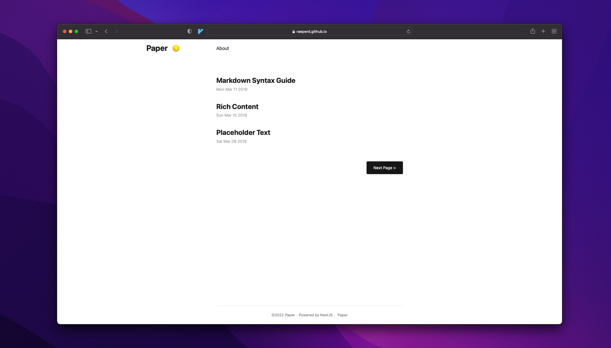
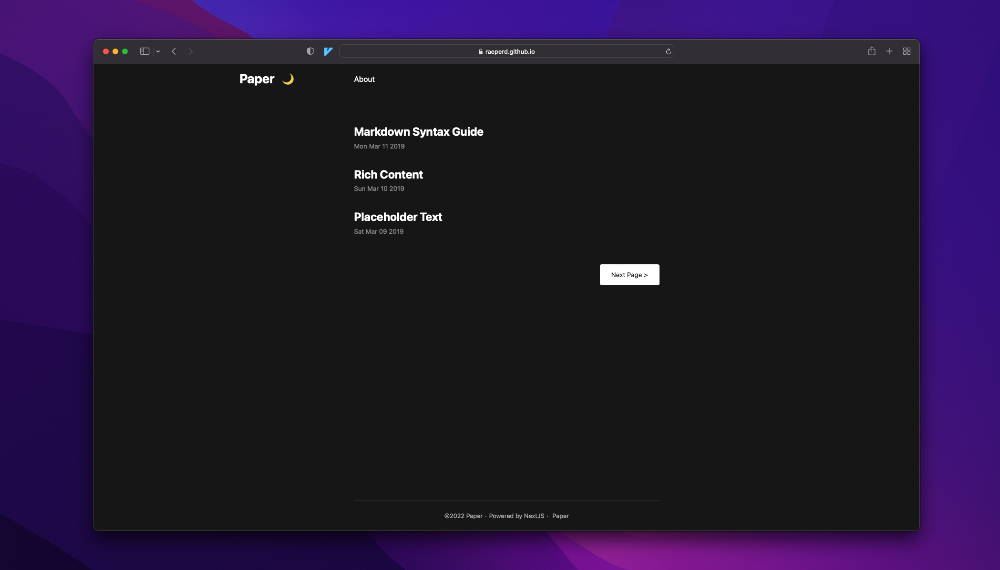
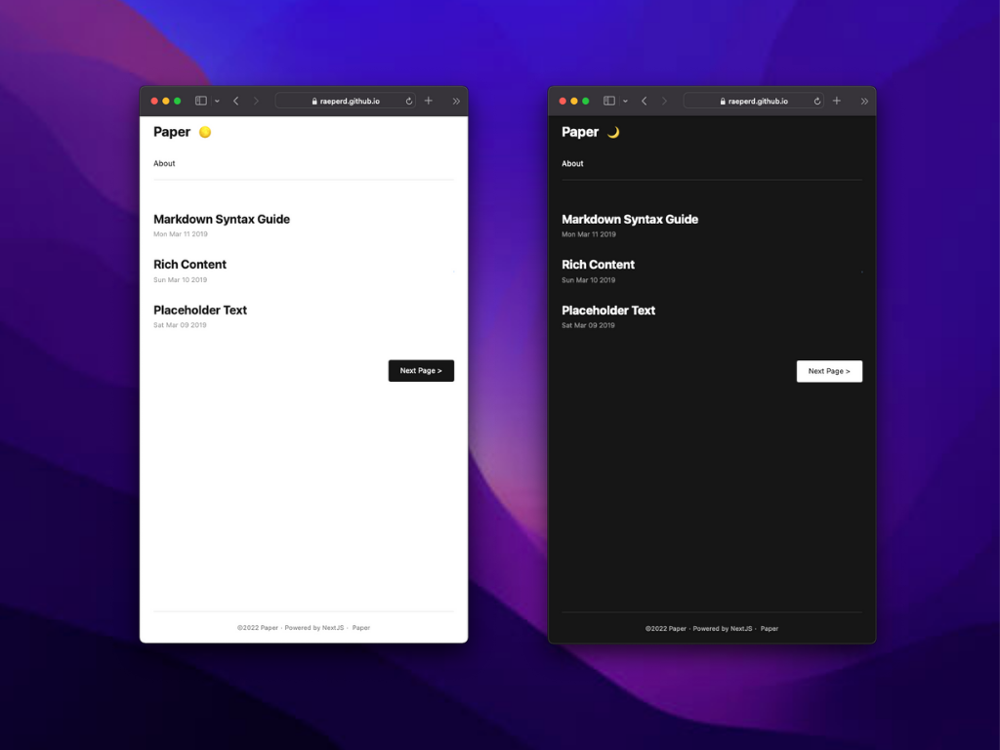

<div align="center">
<h1>NextJS-Paper <sup><sup><sub>5.1</sub></sup></sup></h1>

A simple, clean, flexible NextJS templates inspired by [nanxiaobei/hugo-paper](https://github.com/nanxiaobei/hugo-paper#readme)  
Check out demo in [github page](https://raeperd.github.io/nextjs-paper/)
</div>


# Overview






# Feature
- GFM supprots with tables using [remarkjs/remark-gfm](https://github.com/remarkjs/remark-gfm)
- Katex inline math using [remarkjs/remark-math](https://github.com/remarkjs/remark-math/tree/main/packages/remark-math) and [remarkjs/remark-katex](https://github.com/remarkjs/remark-math/tree/main/packages/rehype-katex) 
- Syntax highlighting using [react-syntax-highlighter](https://github.com/react-syntax-highlighter/react-syntax-highlighter) 
- Inner HTML using [rehypejs/rehype-raw](https://github.com/rehypejs/rehype-raw) 
- Disqus comments using [disqus/disqus-react](https://github.com/disqus/disqus-react) 
- Dark mode using [juliencrn/usehooks-ts](https://github.com/juliencrn/usehooks-ts) 

You can check out my commits if you interested
- [#9 Add GFM supports for tables · raeperd/nextjs-paper@34adc4f](https://github.com/raeperd/nextjs-paper/commit/34adc4f1c303a7c92ba85162a08433d011473c17)
- [#9 Add katex support for markdown · raeperd/nextjs-paper@2a92094](https://github.com/raeperd/nextjs-paper/commit/2a920947963b64af016048ba15f7f976fb2fa2ac)
- [#9 Implements syntax highlighting in article · raeperd/nextjs-paper@bdaa61a](https://github.com/raeperd/nextjs-paper/commit/bdaa61a1b5df950d319e05bc9b4c0b018e9f45b5)
- [#9 Add inner html supports for markdown · raeperd/nextjs-paper@28a8a58](https://github.com/raeperd/nextjs-paper/commit/28a8a58220a83ccc17e8c28fc9d1a69bd08baa40)
- [#17 Implements disqus comment feature · raeperd/nextjs-paper@31cc756](https://github.com/raeperd/nextjs-paper/commit/31cc756942136a58804bc2e3b995d8530c9837f5)
- [#2 Implements DarkMode toggle · raeperd/nextjs-paper@d42fa05](https://github.com/raeperd/nextjs-paper/commit/d42fa057f1ad28a6f43fde2a2ff489bd399d48e0)

# Install

```shell
npm run server
```

You can also serve this page with static htmls after build (which is recommended)

```shell
npm run build && npm run export
```


# Configurations

## `.env` file

```shell
# [OPTIONAL] SITE_NAME value. default is 'Paper'
SITE_NAME=Paper

# [OPTIONAL] SNS ids are all optional. Not shown if empty
INSTAGRAM=raeperd
GITHUB=raeperd
TWITTER=raeperd117

# [OPTIONAL] Disqus configuration. When u want disqus, below two values must be provided
DISQUS_SHORTNAME=nextjs-paper
SERVER_URL=https://raeperd.github.io/nextjs-paper

# [OPTIONAL] Default Author name. Not shown if empty
AUTHOR=raeperd
```

## `next.config.js`

```javascript

const isProduction = process.env.NODE_ENV === 'production'
const name = 'nextjs-paper'

module.exports = {
  assetPrefix: isProduction ? `/${name}/` : '',
  basePath: isProduction ? `/${name}` : '',
  images: {
    loader: 'akamai',
    path: '',
  },
  webpack(config) {
    config.module.rules.push({
      test: /\.svg$/i,
      issuer: /\.[jt]sx?$/,
      use: ['@svgr/webpack'],
    })

    return config
  },
}
```

- If you want to deploy in github-page (like this repo does), `assetPrefix` and `basePath` must be configured as above 

# Notes

- 🙅🏻 Multilingual is not supported  
- ⚙️ Build time may increase, as you want to have many markdown files 

# Thanks to

* [nanxiaobei/hugo-paper: 🪴 A simple, clean, flexible Hugo theme](https://github.com/nanxiaobei/hugo-paper)
* [remarkjs/remark-gfm: remark plugin to support GFM (autolink literals, footnotes, strikethrough, tables, tasklists)](https://github.com/remarkjs/remark-gfm)
* [remark-math/packages/remark-math at main · remarkjs/remark-math](https://github.com/remarkjs/remark-math/tree/main/packages/remark-math)
* [remark-math/packages/rehype-katex at main · remarkjs/remark-math](https://github.com/remarkjs/remark-math/tree/main/packages/rehype-katex)
* [react-syntax-highlighter/react-syntax-highlighter: syntax highlighting component for react with prismjs or highlightjs ast using inline styles](https://github.com/react-syntax-highlighter/react-syntax-highlighter)
* [rehypejs/rehype-raw: plugin to parse the tree again](https://github.com/rehypejs/rehype-raw)
* [disqus/disqus-react: A React component for Disqus](https://github.com/disqus/disqus-react)
* [juliencrn/usehooks-ts: React hook library, ready to use, written in Typescript.](https://github.com/juliencrn/usehooks-ts)
